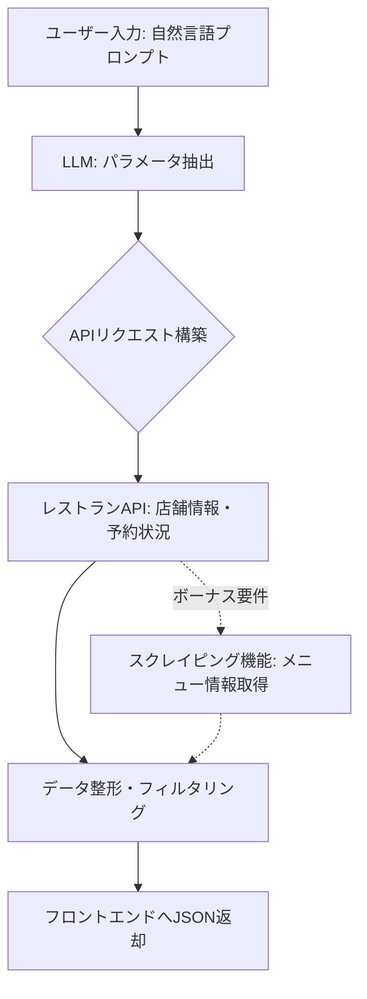

# レストラン検索AIパイプライン 仕様書

## 1. プロジェクト概要
学生・サークル向けの大人数で利用しやすいレストランを、自然言語（プロンプト）で検索できるアプリケーション。
LLMを用いてユーザーの意図を汲み取り、適切なレストラン情報（評価、基本情報）および予約の空き状況を提供する。

- **フロントエンド**: HTML, CSS, JavaScript (Vanilla)
- **バックエンド**: Node.js (JavaScript)
- **制限時間**: 50分（バイブコーディング）

## 2. パイプライン（LLM・API担当）の役割
ユーザーからの自然言語プロンプトを受け取り、以下の処理を経てフロントエンドへデータを返す。

1. **意図抽出 (LLM)**: プロンプトから「人数」「時間」「場所」「その他の希望（学生向け、サークル後、安いなど）」を抽出。
2. **情報検索 (API)**: 抽出した条件をもとに、外部のレストラン情報APIを叩く。
3. **データ整形**: 取得した情報を整理し、「評価」「基本情報」「予約状況」を含めたレスポンスを生成。
4. **（ボーナス）スクレイピング**: メニュー情報を対象レストランのウェブサイトから取得し付与する。

## 3. システムフロー



## 4. APIインターフェース設計 (想定)

### `POST /api/search`
自然言語によるレストラン検索・空き状況確認を行うエンドポイント。

#### リクエスト (Request)
```json
{
  "prompt": "今日サークル終わりに20人で入れる安い居酒屋を探して。時間は19時から。"
}
```

#### レスポンス (Response)
```json
{
  "status": "success",
  "data": {
    "parsed_conditions": {
      "people": 20,
      "time": "19:00",
      "date": "今日",
      "keywords": ["安い", "居酒屋", "サークル終わり"]
    },
    "restaurants": [
      {
        "id": "123456",
        "name": "大衆居酒屋 学生の味方",
        "address": "東京都...",
        "rating": 4.2, // ※注意: ホットペッパーAPIでは評価値は取得できないため、モック値または非表示とする
        "availability": {
          "can_reserve": true,
          "status": "○ (空きあり)"
        },
        "info": {
          "budget": "2000円〜3000円",
          "capacity": 50,
          "features": ["大人数歓迎", "学生向けコースあり"]
        },
        "menu_summary": "焼き鳥盛り合わせ 500円, 飲み放題 1000円..." // ボーナス実装
      }
    ]
  }
}
```

## 5. 実装ステップ（50分間のタイムアタック向け）

50分という短い時間で完成させるための、優先度順のステップです。

### Step 1: モックサーバーの立ち上げ (0〜10分)
- `Express` などのフレームワークでエンドポイント (`POST /api/search`) を作成。
- まずは固定のJSONを返すようにして、**フロントエンド担当との繋ぎ込み**を最優先で行う。

### Step 2: LLMを用いた意図抽出の実装 (10〜25分)
- LLM (OpenAI API / Gemini API等) を呼び出す処理を実装。
- プロンプトから JSON形式で検索条件（人数、時間など）を抽出する。
- *Tips: LLMの「JSONモード (Structured Output)」を使うとパースエラーを防げます。*

### Step 3: レストランAPIとの連携 (25〜40分)
- 抽出したパラメータを使って、実際のレストランAPI（ホットペッパーグルメAPIなど）を叩く。
- API結果から、「評価」「基本情報」「空き状況」をレスポンスの形式にマッピングする。
- *※時間が足りない場合は、検索部分はAPIを使い、空き状況はモックデータを返すなどの妥協も選択肢に入れます。*

### Step 4: ボーナス機能・メニュー取得 (40〜50分)
- 余裕があれば実装。店舗URLから `cheerio` (静的HTML) や `puppeteer` (動的) でメニュー情報を取得。
- 取得したテキストをLLMに投げて、主要なメニューを要約させる方法がおすすめです。

## 6. 推奨技術スタック
- **フロントエンド**: HTML, CSS, JavaScript (Vanilla)
- **バックエンド**: Node.js + Express.js
- **LLM API**: Google Gemini API または OpenAI API
- **Restaurant API**: ホットペッパーグルメ Webサービス API
- **Scraping (Bonus)**: `cheerio` または `puppeteer`

## 7. 【重要】評価（星の数）取得のフェーズ分けについて
ホットペッパーAPIではレビュー点数（4.5など）が取得できないため、以下のフェーズに分けて実装します。
- **フェーズ1（初期実装）**: モックとして、バックエンドで `3.5 ~ 4.8` 程度のランダムな数値を生成してフロントエンドに返します。（スピード優先）
- **フェーズ2（拡張実装）**: 時間が許せば、ホットペッパーAPIで取得した店名と住所をもとに `Google Places API` を叩き、実際の評価値を取得・マージする処理を追加します。
